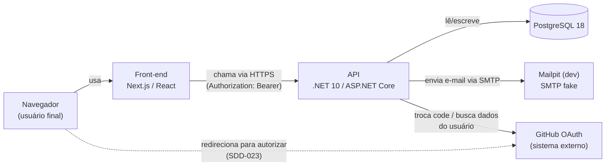
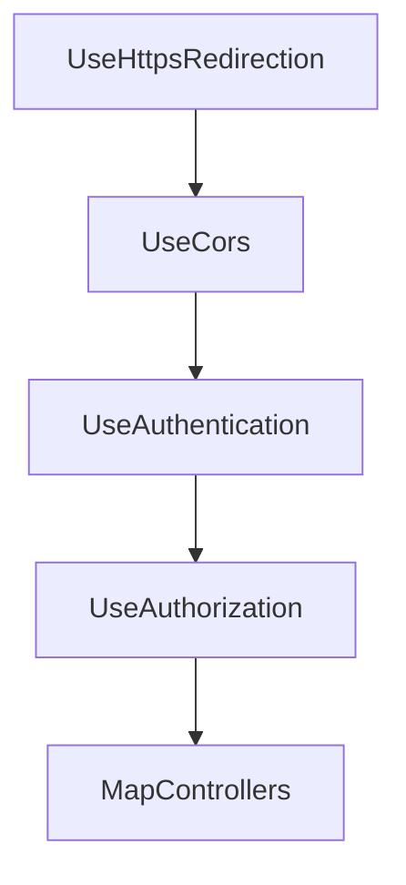

# Knowledge — Fluxo de requisição do back-end (C4 + pipeline)

> Conhecimento durável, usado por mais de um SDD. Se isso só importa para uma funcionalidade específica, mova para o SDD dela.

## Contexto

Primeira aplicação prática de `knowledge/c4-model.md` neste projeto (o documento existia só como metodologia, sem nenhum diagrama real ainda). Para convenções de camadas/padrões de código do back-end (Controller/Service, padrão `Resultado*`, configuração fail-fast), ver `knowledge/backend-arquitetura.md` — deliberadamente separado deste. Aqui: como as peças se encaixam (Container) e como uma requisição atravessa o pipeline até virar resposta (Dynamic).

## Conteúdo

### Diagrama de Container (C4 nível 2)

- **SPA e API são deployáveis separadamente** (front-end roda nativo/`pnpm dev`, back-end + Postgres em Docker — `SDD-001`) — por isso são Containers distintos, não um só.
- O redirecionamento do browser direto para o GitHub (linha tracejada) **não passa pela API** — só a troca do `code` por token acontece server-to-server (`LoginGithubService` → GitHub), nunca o front-end fala diretamente com a API do GitHub além do redirect inicial.

### Pipeline de middleware (`Program.cs`) — ordem e por quê

| Ordem | Middleware | Por que nessa posição |
|---|---|---|
| 1 | `UseHttpsRedirection` | Antes de qualquer outra coisa — não processa nada em texto plano. |
| 2 | `UseCors` | **Antes** de `UseAuthentication`: o preflight `OPTIONS` do browser não carrega `Authorization` nem cookie de sessão — se CORS viesse depois da autenticação, o preflight seria rejeitado antes de a política de CORS ser avaliada, e a chamada real nunca sairia (bug real, encontrado e corrigido durante um smoke test local desta sessão — ver `specs/SDD-005-login.md`, Registro de execução). |
| 3 | `UseAuthentication` | Resolve **quem** é o usuário (valida o JWT, popula `HttpContext.User`) antes de decidir o que ele pode fazer. |
| 4 | `UseAuthorization` | Decide **o que** o usuário autenticado pode fazer (`[Authorize]` nos endpoints) — depende de `UseAuthentication` já ter rodado. |
| 5 | `MapControllers` | Só depois de todo o pipeline acima, a requisição chega no Controller/Service. |

### Fluxo dinâmico (C4 Dynamic) — login

Diagramas de sequência do login (e-mail/senha e GitHub OAuth), com front-end **e** back-end detalhados peça por peça — ver `knowledge/fluxo-login.md`, documento dedicado (deliberadamente separado deste: aqui é o pipeline/Container genérico, lá é o fluxo específico de login).

## Fora do escopo

- Convenções de camadas/padrões de código (Controller/Service, `Resultado*`, fail-fast) — ver `knowledge/backend-arquitetura.md`.
- Diagramas de sequência de login (front-end + back-end) — ver `knowledge/fluxo-login.md`.
- Diagrama de Deployment (infraestrutura de produção) — ainda não decidido (`specs/SDD-002-pipeline-cicd-self-hosted.md` deixa a estratégia de CD em aberto).
- Diagrama de Component (estrutura interna da API além de Controller→Service→DbContext) — não há complexidade interna que justifique esse nível ainda (ver `knowledge/c4-model.md`, "Quando desenhar cada nível").

---

## Referenciado por

| Documento | Caminho |
|---|---|
| SDD — Login e cadastro via GitHub | `specs/SDD-023-login-cadastro-via-github.md` |
| Knowledge — C4 Model | `knowledge/c4-model.md` |
| Knowledge — Arquitetura do back-end | `knowledge/backend-arquitetura.md` |
| Knowledge — Fluxo de login | `knowledge/fluxo-login.md` |

> Se nada referencia este documento, ele provavelmente não devia existir (ou devia estar dentro de uma spec específica).

## Referências

- `knowledge/c4-model.md` — metodologia aplicada aqui
- [Mermaid — C4 diagrams](https://mermaid.js.org/syntax/c4.html)
