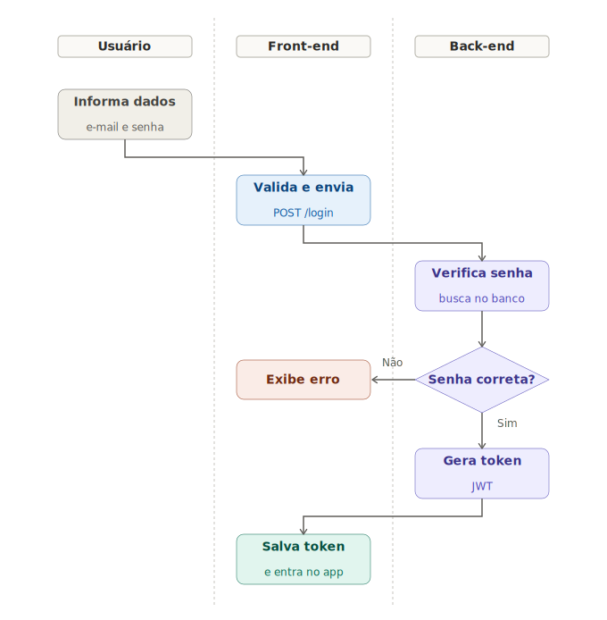
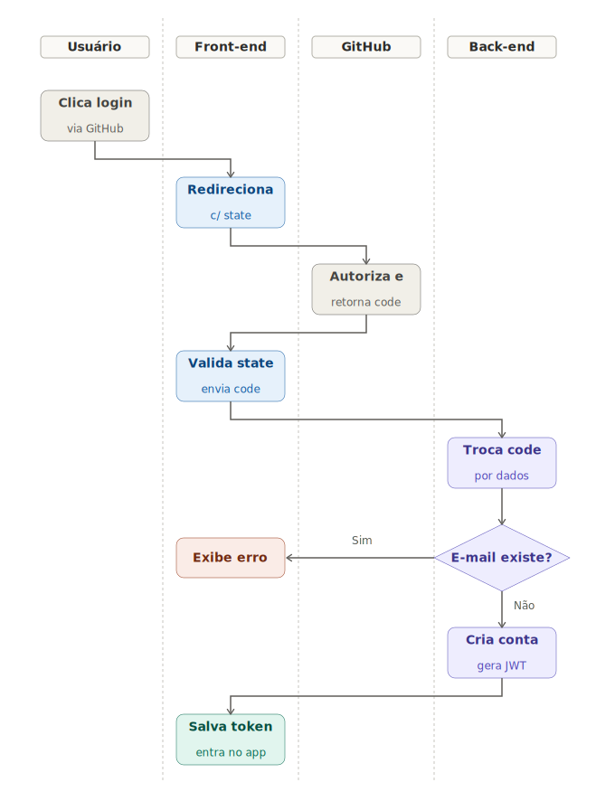
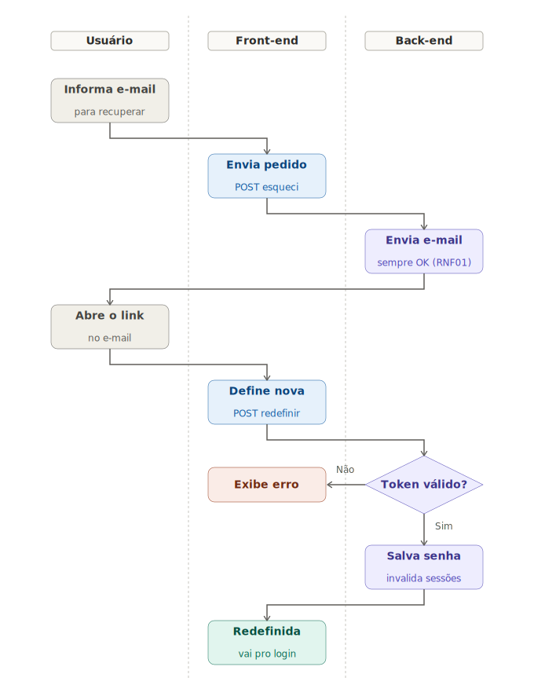
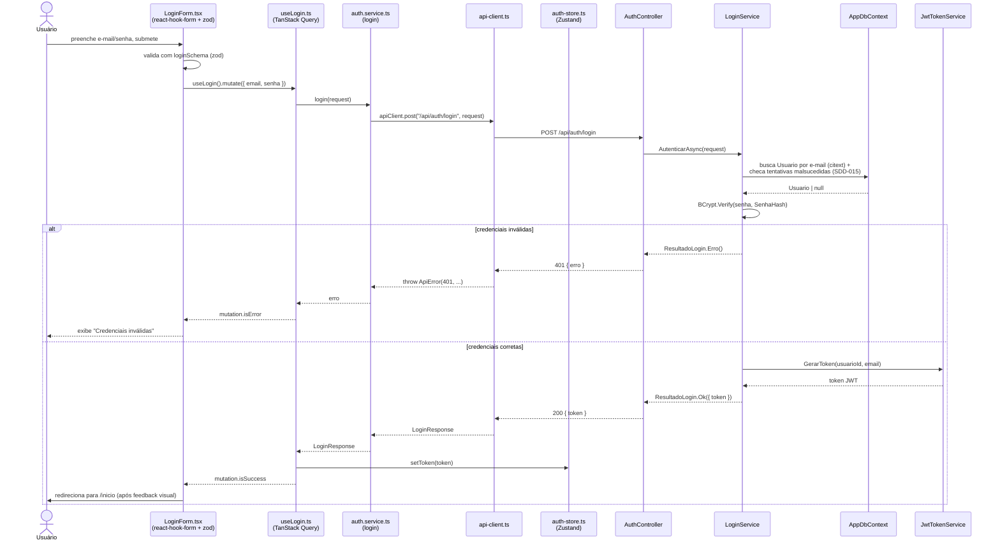
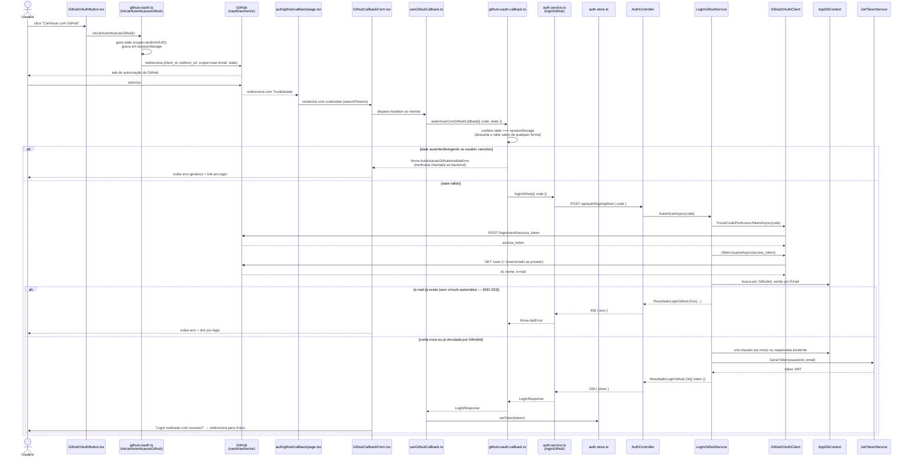
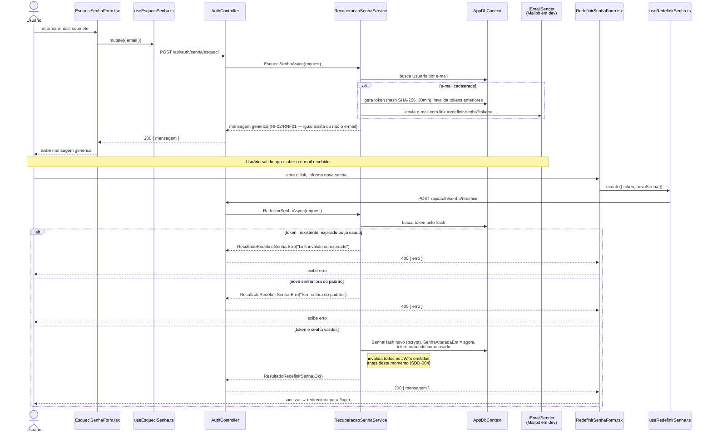

# Knowledge — Fluxo de login e recuperação de senha (front-end + back-end)

> Conhecimento durável, usado por mais de um SDD. Se isso só importa para uma funcionalidade específica, mova para o SDD dela.

## Contexto

Diagrama dedicado ao fluxo de login e recuperação de acesso (e-mail/senha, GitHub OAuth e "esqueci minha senha"), cobrindo front-end **e** back-end juntos, peça por peça. Complementa `knowledge/backend-fluxo-de-requisicao.md` (que cobre o Container C4 e o pipeline de middleware de forma genérica, não específica de login) e `knowledge/backend-arquitetura.md` (que descreve, em prosa, o tipo de sessão/autenticação — JWT, stateless, sem refresh). Aqui: só o desenho de ponta a ponta.

## Conteúdo

### Fluxograma (SVG, com raias por ator)

Versão visual, com raias (swimlanes) separando o que cada ator faz — Usuário, Front-end, Back-end (e GitHub, no segundo). Arquivo próprio, autocontido (abre direto no navegador, com suporte a tema claro/escuro), complementar aos diagramas de sequência Mermaid abaixo, que detalham os nomes reais de função/arquivo.

**Login por e-mail e senha:**

**Login/cadastro via GitHub:**

**Recuperação de senha ("esqueci minha senha"):**

### Login por e-mail e senha (`SDD-005`)

### Login/cadastro via GitHub (`SDD-023`)

### Recuperação de senha — "esqueci minha senha" (`SDD-014`)

### Pontos em comum entre os três fluxos

- **Convergência no token:** login por e-mail/senha e por GitHub terminam chamando `JwtTokenService.GerarToken` e gravando o resultado em `auth-store.ts` (`setToken`) — a partir daí, não há diferença nenhuma entre uma sessão iniciada por senha ou por GitHub (mesmo JWT, mesmas regras de expiração/invalidação, ver `knowledge/backend-arquitetura.md`, "Autenticação e sessão"). A recuperação de senha é a exceção deliberada: **não** gera sessão — termina redirecionando para `/login`, o usuário autentica de novo com a senha nova.
- **Erro sempre chega como mensagem pronta:** `ApiError` (erro HTTP do contrato), `AutorizacaoGithubInvalidaError` (validação local do `state`) e os erros de `RedefinirSenhaAsync` chegam ao componente como uma mensagem de texto já pronta para exibir — nenhum componente decide o texto do erro, só decide *onde* exibir.
- **Sem persistência entre reloads:** o token vive só em memória (`auth-store.ts`, sem `zustand/middleware persist`) — um F5 desloga, decisão deliberada de `specs/SDD-005-login.md` ("Fora do escopo").
- **Mesmo mecanismo de invalidação de sessão:** redefinir a senha (recuperação) e trocar a senha autenticado (`SDD-018`) usam o mesmo campo `Usuario.SenhaAlteradaEm` para invalidar JWTs antigos — um único mecanismo genérico (`SDD-004`, "Revisão — SDD-014"), não uma implementação por SDD.

## Fora do escopo

- Diagrama de Container/pipeline de middleware genérico — ver `knowledge/backend-fluxo-de-requisicao.md`.
- Detalhes de por que JWT/stateless foi escolhido — ver `specs/SDD-004-cadastro-de-usuario.md`.
- Fluxo de cadastro por e-mail/senha (`SDD-004`) e demais fluxos de conta (verificação de e-mail, troca de senha autenticado, exclusão de conta) — mesma estrutura de diagrama, ainda não desenhados; adicionar aqui se/quando fizerem falta.

---

## Referenciado por

| Documento | Caminho |
|---|---|
| SDD — Login | `specs/SDD-005-login.md` |
| SDD — Login e cadastro via GitHub | `specs/SDD-023-login-cadastro-via-github.md` |
| SDD — Recuperação de senha | `specs/SDD-014-recuperacao-de-senha.md` |
| Knowledge — Fluxo de requisição do back-end | `knowledge/backend-fluxo-de-requisicao.md` |
| Knowledge — Arquitetura do back-end | `knowledge/backend-arquitetura.md` |

> Se nada referencia este documento, ele provavelmente não devia existir (ou devia estar dentro de uma spec específica).

## Referências

- [Mermaid — Sequence diagrams](https://mermaid.js.org/syntax/sequenceDiagram.html)
- `knowledge/c4-model.md` — diagrama Dynamic é o equivalente C4 de um diagrama de sequência
